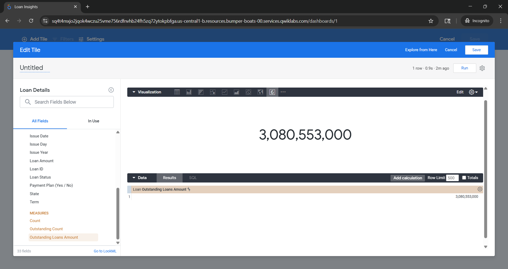
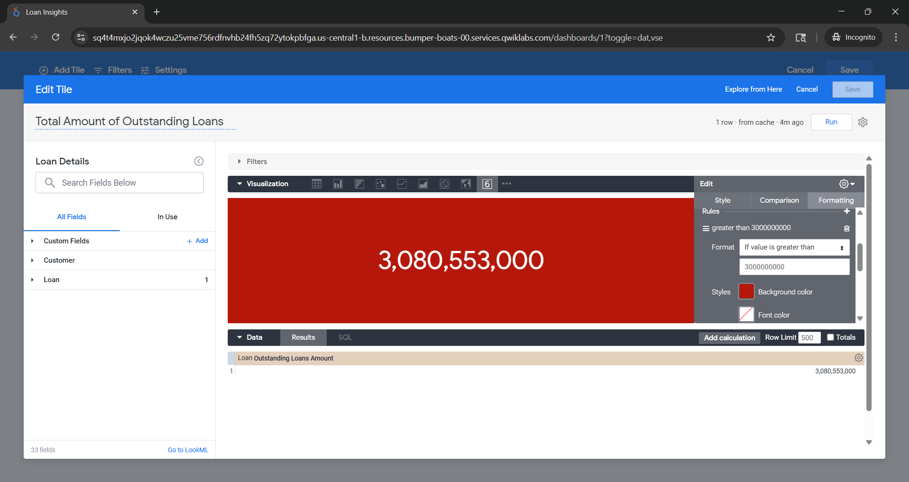
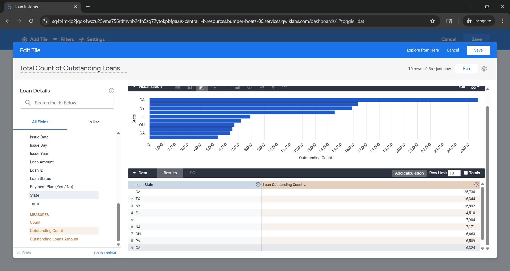
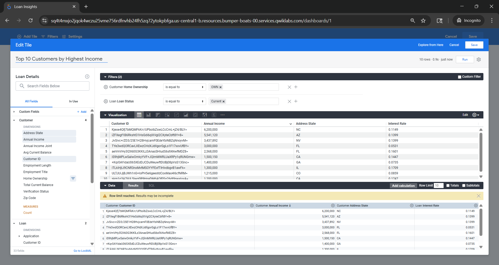
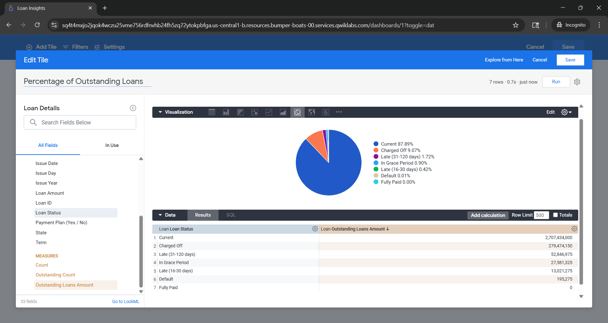
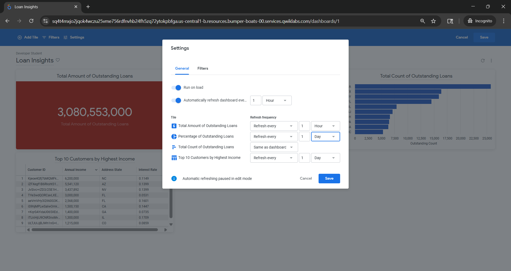
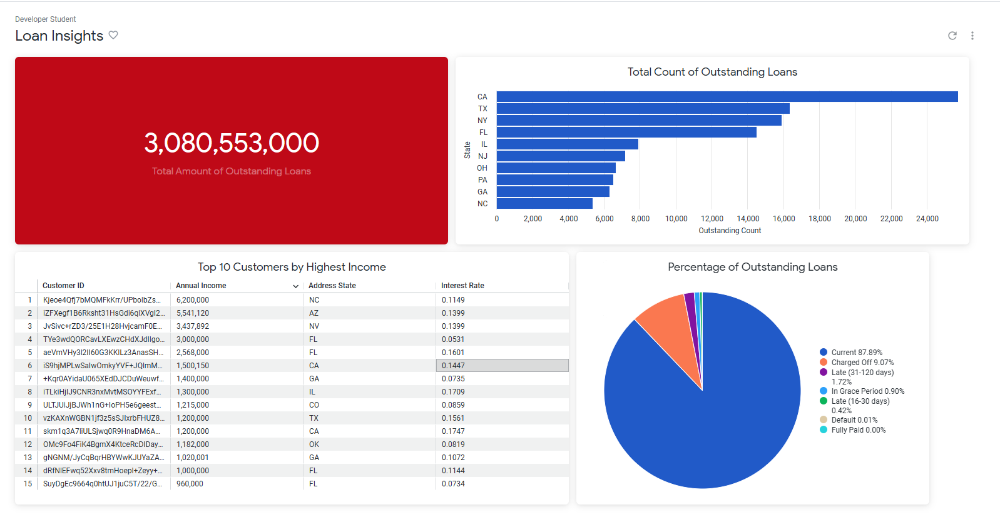

# 📊 Dashboard Walkthrough – Loan Insights

This document shows the step-by-step creation of the Looker dashboard along with visuals.

---

## 🔹 1. Creating KPI Tile – Total Outstanding Loans

- Selected measure: **Outstanding Loans Amount**
- Used single value visualization

---

## 🔹 2. Applying Conditional Formatting Rule

- Added rule:
  - If value > 3,000,000,000 → Background color = Red
- Helps highlight high loan exposure

---

## 🔹 3. Creating Bar Chart – Loan Count by State

- Dimension: **State**
- Measure: **Outstanding Count**
- Sorted in descending order
- Limited to top 10 states

---

## 🔹 4. Creating Table – Top Customers by Income

- Fields used:
  - Customer ID
  - Annual Income
  - Address State
  - Interest Rate
- Applied filters:
  - Home Ownership = OWN
  - Loan Status = Current

---

## 🔹 5. Creating Pie Chart – Loan Status Distribution

- Dimension: **Loan Status**
- Measure: **Outstanding Loans Amount**
- Shows percentage distribution

---

## 🔹 6. Dashboard Settings (Auto Refresh)

- Enabled auto-refresh:
  - KPI → Every 1 hour
  - Other tiles → Daily
- Enabled "Run on load"

---

## 🔹 7. Final Dashboard View

- Combined all tiles into one dashboard
- Enabled interactive filtering

